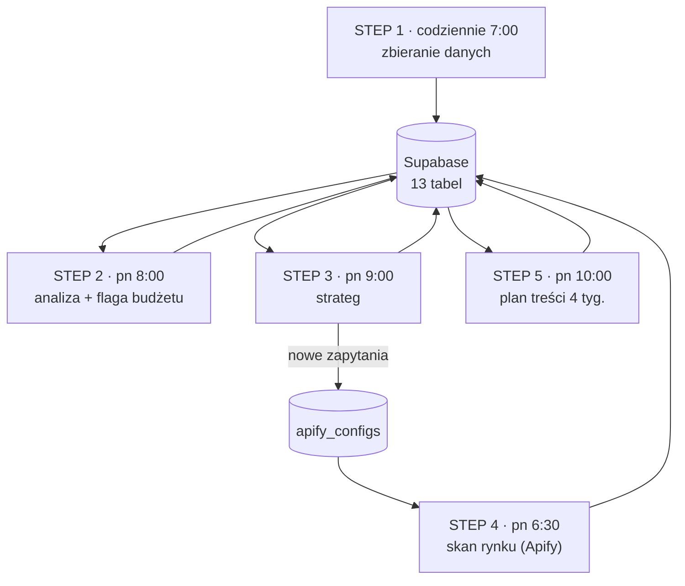

# Autonomiczny system marketing intelligence

Pięć workflow n8n, które codziennie zbierają dane marketingowe z ośmiu źródeł, raz w tygodniu je analizują, flagują kampanie reklamowe do wyłączenia albo zwiększenia budżetu i układają plan treści na cztery tygodnie. Bez udziału człowieka.

System działa produkcyjnie i obsługuje realny sklep e-commerce - codziennie o 7:00 oraz w poniedziałki o 6:30, 8:00, 9:00 i 10:00.

**Stack:** n8n · Claude (Anthropic API) · Supabase (PostgreSQL) · Apify

---

## Skala

| | |
|---|---|
| Workflow | 5 |
| Nodes | 118 |
| Tabel w bazie | 13 |
| Zewnętrznych API | 8 |
| Wywołań modelu językowego | 6 |

---

## Jak to działa

| Kiedy | Krok | Co robi |
|---|---|---|
| codziennie 7:00 | **STEP 1** - zbieranie danych | Pobiera posty, zasięgi, wyniki kampanii, ruch na stronie i dane demograficzne do warstwy surowej |
| poniedziałek 6:30 | **STEP 4** - moduł Apify | Skanuje rynek i konkurencję według listy zapytań trzymanej w bazie |
| poniedziałek 8:00 | **STEP 2** - analiza | Ocenia stan marki i rynek. Osobno, deterministycznie, flaguje budżet kampanii |
| poniedziałek 9:00 | **STEP 3** - strateg | Wyciąga wnioski, buduje ranking wzorów produktowych, zapisuje nową konfigurację skanu |
| poniedziałek 10:00 | **STEP 5** - plan | Układa kalendarz treści na 4 tygodnie z blokadą powtarzania tematów |

### Przepływ



---

## Źródła danych

- **Facebook Graph API** - strony, opublikowane posty z podsumowaniem reakcji i komentarzy
- **Facebook Ads API** - kampanie i insights: impressions, reach, clicks, CTR, CPC, CPM, spend, actions, w rozbiciu dziennym
- **Instagram Graph API** - media konta biznesowego i insights per post
- **YouTube Data API** - statystyki wideo
- **Google Analytics 4** - cztery raporty: po dacie, źródle sesji, ścieżce strony i mieście
- **API GUS** - dane demograficzne i płacowe miast, jako warstwa potencjału rynkowego
- **Apify** - aktorzy scrapujący TikToka, Instagrama i Facebooka, uruchamiani dynamicznie z konfiguracji w bazie
- **Własny pixel** - zdarzenia behawioralne ze strony produktowej: procent scrolla, powiększenie zdjęcia, odtworzenie wideo, zmiana wariantu, czas na opisie

---

## Decyzja projektowa: co robi kod, a co model

Nie wszystko trafia do modelu językowego. Podział jest świadomy.

**Kod deterministyczny** dostaje decyzje, które muszą być powtarzalne i audytowalne:

- flagowanie budżetu kampanii - ten sam zestaw danych wejściowych zawsze da tę samą flagę
- ranking wzorów produktowych na sygnałach behawioralnych
- scalanie i normalizacja konfiguracji skanu rynku

**Model językowy** dostaje zadania, w których nie istnieje jedna poprawna odpowiedź:

- interpretacja tego, co zadziałało i dlaczego
- jakie tematy chwytają w niszy
- dopasowanie targetu, dobór tematów treści

Zasada jest prosta: **co da się zapisać regułą, zapisuję regułą.** Gdyby model raz powiedział „wyłącz", a raz „zwiększ" przy tych samych liczbach, nie dałoby się tego ani odtworzyć, ani wytłumaczyć.

→ [`flaga-budzetu.js`](flaga-budzetu.js) · [`ranking-wzorow.js`](ranking-wzorow.js)

---

## Pętla samo-korygująca

Najciekawszy element systemu. Analiza z jednego tygodnia zmienia to, czego system szuka w tygodniu kolejnym.

```
pn 6:30   STEP 4  →  czyta apify_configs  →  odpala aktorów Apify  →  zapis do apify_rynek

pn -   STEP 3  →  czyta apify_rynek + własne dane
                  →  STRATEG 2 zwraca apify_zmiany:
                       { hashtagi_dodac[], hashtagi_usunac[], zapytania[] }
                  →  kod normalizuje, transliteruje polskie znaki, deduplikuje
                  →  PATCH apify_configs

pn 6:30   STEP 4  →  czyta apify_configs  ←  JUŻ ZE ZMIENIONĄ LISTĄ
(za tydzień)
```

**Bezpiecznik:** jeżeli po zastosowaniu usunięć zostałoby mniej niż dwa zapytania, kod przywraca poprzednią listę. Model nie może jednym błędnym wynikiem wyłączyć całego skanu rynku.

→ [`scal-configi.js`](scal-configi.js)

---

## Rozwiązane problemy produkcyjne

**Prompt przekraczał okno kontekstu.** Tabela z wynikami scrapingu trzymała surowy payload jsonb, około 5 KB na wiersz. Osiemdziesiąt wierszy zabijało prompt. Rozwiązanie: projekcja wyłącznie lekkich pól plus twardy limit wierszy. Pełny payload zostaje w bazie.

**Model zwracał JSON w blokach markdown.** Każde wyjście przechodzi przez parser: usunięcie znaczników code fence, wycięcie zakresu od pierwszego nawiasu klamrowego do ostatniego, `JSON.parse` w bloku `try`. Przy niepowodzeniu parser nie przerywa przepływu, tylko zapisuje poprawny strukturalnie wiersz z fragmentem błędnej odpowiedzi.

**Odpowiedź modelu przychodziła w pięciu kształtach.** Zależnie od wersji node i modelu treść siedziała w tablicy `content`, w `parts`, w polu `text`, w `output` albo bezpośrednio jako string. Ekstraktor obsługuje wszystkie warianty, zanim cokolwiek zacznie parsować.

**Nazwy kampanii nie pasowały do danych z pixela.** Facebook nazywa promowany post inaczej niż Instagram, a oba inaczej niż zapisuje to własny pixel. Rozwiązanie: klucz rozmyty - usunięcie prefiksów, cudzysłowów typograficznych i znaków niealfanumerycznych, obcięcie do 30 znaków. Dopiero po tym łączy się koszt kampanii ze współczynnikiem odrzuceń.

**Polskie znaki rozbijały deduplikację hashtagów.** Mapa transliteracji stosowana wyłącznie do porównywania, przy zachowaniu oryginalnego zapisu w zapisywanej wartości.

**API GUS jest wolne i limitowane.** Router cache: jeżeli dane są świeższe niż ustalony próg, gałąź zwraca pustą tablicę i reszta łańcucha w ogóle się nie uruchamia.

**Model traktował NULL jako zero.** Brak danych o zasięgu był interpretowany jako zerowy zasięg, co przekłamywało wnioski. Rozwiązanie po stronie promptu - jawna instrukcja rozróżniająca brak danych od wartości zerowej.

**Planista recyklował tematy.** Do promptu trafia 25 ostatnich publikacji, skróconych do 70 znaków, z jawną instrukcją nietworzenia ich wariantów.

---

## Odporność

Kolejne kroki czytają z bazy okno czternastodniowe, nie ostatni wynik. Jeden nieudany przebieg nie zatrzymuje kaskady - system pracuje na ostatniej dobrej analizie. To był świadomy wybór: lepiej stracić jeden tydzień analizy niż wywalić cały łańcuch i zostać bez planu treści.

---

## Ograniczenia i kierunek rozwoju

- **Brak alertu przy błędzie parsowania.** Błąd zapisuje się do bazy, ale nikt nie dostaje powiadomienia.
- **Progi budżetowe skalibrowane ręcznie.** Wartości pochodzą z obserwacji, nie z analizy rozkładu historycznego. Oznaczone w kodzie jako do kalibracji.
- **Mała próba w rankingu wzorów.** Przy mniej niż pięciu unikalnych osobach wynik jest sygnałem kierunkowym, nie rozstrzygnięciem. Zapisane jako adnotacja w danych wyjściowych, żeby model nie traktował tego jako pewnika.

---

## Czego tu nie ma

Repozytorium zawiera opis architektury i wybrane fragmenty logiki. **Nie zawiera** eksportów workflow ani żadnych poświadczeń, adresów bazy czy identyfikatorów kont - system pracuje na produkcji.


---

## Kontakt

**Sebastian Rzadkiewicz** - automatyzacja procesów · n8n · Make.com · integracje API

LinkedIn: https://www.linkedin.com/in/sebastian-r-73b85a398/
